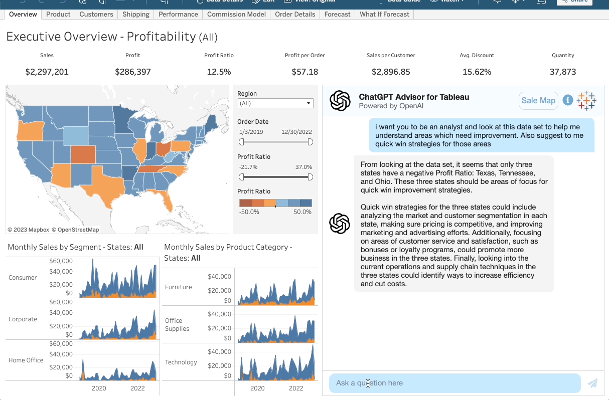
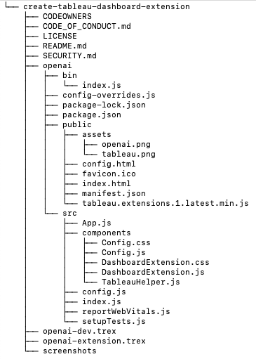

# Tableau Dashboard Extension integratino with OpenAI's ChatGPT 

This dashboard extension provides a chat window for users to ask questions about the data in their dashboard.  When it first loads it takes data from the selected sheet, and passes it to OpenAI's [Completion](https://platform.openai.com/docs/guides/completion) API.  We also use a default question, so that the chatbot can give us some insights automatically.  Once this first question has been answered, the user can ask additional questions.  The chatbot will take into account the summary data from that sheet as well as public data, in order to provide an answer.

**Note:** This dashboard extension sends your data to OpenAI in order to generate the text responses.  Only use this extension with non-sensitive data that is allowed to be sent to a 3rd party.

##  Development
This project has the following directory structure:



The top level of this project is just the standard Salesforce required files (license, security, etc).  All source code is within the `openai` directory, so assuming you just cloned this repository you would need to run the following commands:
```
cd tableau-dashboard-extension-openai/create-tableau-dashboard-extension/openai
npm init
npm run start
``` 
This changes into the directory of the web app (where package.json lives, installs all dependencies, and starts up the dev server locally.  This will start up the web app running at http://localhost:3000.  If you want to try this in Tableau, load the `openai-dev.trex` file as your dashboard extension.  This will point to the web app running on localhost.

## Deployment
Since this is a client-side only web app, it can be hosted in any platform that supports hosting static files.  The deployment process consists of three steps: 
1) build the app 
2) host the files in the `build` folder 
3) update the trex file, to point to your hosted web app

### Github Pages
Assuming you've got this web app's source code living in a github repository, you can use [Github Pages](https://pages.github.com/) to host your static files. Run the below command to build the web app:
```
npm run deploy
```
Update your trex file to point to your web app in S3.


### S3 bucket
In order to host using S3, you need access to an AWS account.  There are some setup steps to get started, you can follow a guide like [this](https://adamtheautomator.com/aws-s3-static-ssl-website/) to get your environment ready.  Assuming you've got a bucket created and want to host this web app under a folder named *openai*, use the below command to build the web app's static files:
```
npm run builds3 
```
This will build all the files needed for the web app, and put them in a folder named *build*.  If you want to host at the root of your bucket (or another folder), just change the builds3 command in package.json's script section.  You'll just need to change the value */openai* to whatever path you'd like to use.  This is necessary so that the index.html file can find the proper path to all other files it needs.

Now that you have your static files, upload them to your S3 bucket and you should be able to access it through a web browser.  Update your trex file to point to your web app in S3.

## Known Issues [TBD]
* Currently, only questions in english have been tested
* If you've tried [ChatGPT](https://openai.com/blog/chatgpt), you will be accustomed to working within a *session*.  You ask an initial question and then can ask follow ups without losing context.  Since ChatGPT's API is not publically available yet, we are using the [Completion](https://platform.openai.com/docs/api-reference/completions) endpoint instead.  This works pretty well, but it does not have a concept of sessions or history.  This means we have to pass the summary data from the sheet with each API call.  
* Data volumes: OpenAI's public API only allows prompts of a certain size.  This extension uses the `text-davinci-003` model, which allows up to 4000 [tokens](https://help.openai.com/en/articles/4936856-what-are-tokens-and-how-to-count-them).  This means the summary data we send to OpenAI must be relatively small in size.  The maximum # rows will vary, depending on number of columns and how much long text is within each column.
## References

### OpenAI
This dashboard extension leverage OpenAI's public REST API to generate the responses from the chatbot.  The documentation on OpenAI's APIs can be found here:
https://platform.openai.com/docs/introduction
### ChatScope
In order to display the responses in a format that looks like a chatbox, this web app leverages ChatScope's Chat UI Kit React.  The documentation on this can be found here:
https://chatscope.io/storybook/react/?path=/story/documentation-introduction--page

### Simple React Modal
The sheet selector button opens a modal window with a list of sheets.  Clicking on a sheet resets the chat, and passes in the data from that sheet to OpenAI's API.  More information on how to use the modal window can be found here:
https://www.npmjs.com/package/simple-react-modal